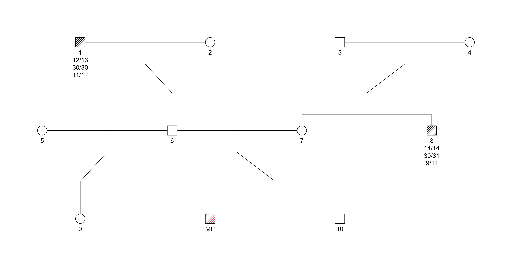
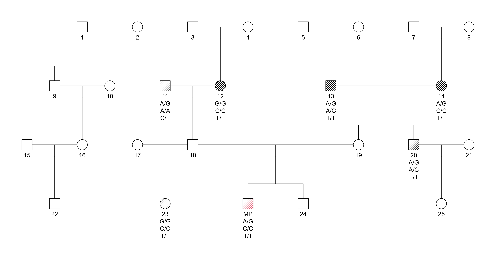
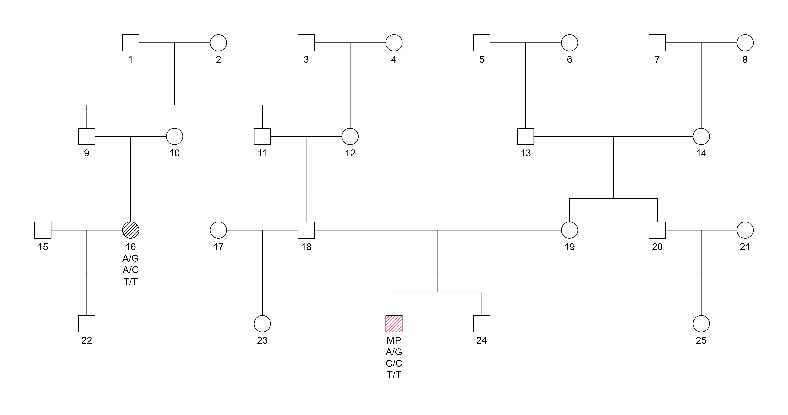

## 🧬 Introduction

In forensic genetics, **Short Tandem Repeats (STRs)** have been the key of human identification for over two decades.  
Current forensic systems typically use **24 autosomal STR markers**, forming the global standard for paternity testing, missing person identification (MPI) and disaster victim identification (DVI).  

However, the field is now **gradually migrating toward high-density Single Nucleotide Polymorphism (SNP) technologies**.  
This transition is motivated by the need for **greater statistical resolution**, improved ability to detect **distant kinship**, and compatibility with **degraded DNA samples** often recovered in humanitarian and forensic contexts.

---

## ⚖️ Likelihood Ratios in Forensic Inference

The foundation of modern forensic kinship evaluation is **Bayesian statistical inference**, where evidence is interpreted by comparing how well different biological scenarios explain the observed DNA data.  
In this framework, the central quantity is the **Likelihood Ratio (LR)**

$$
LR = \frac{P(\text{Genetic data} \mid H_1)}{P(\text{Genetic data} \mid H_2)}
$$

where:

- $H_1$: the hypothesis that the tested individuals are **biologically related**,  
- $H_2$: the hypothesis that they are **unrelated**.

An LR greater than 1 supports relatedness, while values below 1 support non-relatedness.  

---

## 🧪 Hypotheses in a Missing Person Identification (MPI) case

In missing person investigations we rarely have a DNA profile from the missing person (MP) itself.  
Instead, we collect DNA from **biological relatives** (parents, siblings, aunts/uncles, grandparents) and compare those profiles with a **person of interest (POI)**.

The figure below illustrates the two competing hypotheses that underlie the LR:

- **$H_1$: POI = MP**  
  The POI is assumed to occupy the *missing person’s position* in the pedigree.  
  The green square is both POI and MP, and the LR numerator is the probability of observing the relatives’ genotypes **if the POI truly belongs in that family**.

- **$H_2$: POI is unrelated**  
  The MP still belongs in the pedigree, but the POI is now placed **outside the family**, as an unrelated individual from the reference population.  
  The denominator of the LR is the probability of the same genetic data **if the POI is just a random, unrelated person**.
  
The LR summarizes how much more (or less) compatible the observed DNA is with the *POI = MP* scenario than with the *POI unrelated* scenario.  
This pedigree allows the same set of typed individuals to be interpreted under different hypotheses-such as *related* versus *unrelated*-by changing only the biological connections between them.

To help interpret the diagrams, note that forensic pedigrees follow standard genetic notation:

- **Squares** represent **males**, and **circles** represent **females**.  
- **Unfilled symbols** denote individuals **without genetic data**, whereas **hatched or colored symbols** indicate those who are **genotyped** or specifically highlighted in the analysis (e.g., the MP or typed reference relatives).  
- **Horizontal lines** connect biological parents, and **vertical lines** descend from parents to their children.  
- When multiple siblings are present, they share a single vertical line that branches horizontally.  
- Generations are arranged from **top to bottom**, with older generations above and descendants below.  

---

## 🎲 STR Kinship Simulations and Statistical Power

To understand how well traditional STR markers perform in kinship inference, we can simulate thousands of conditioned profiles and calculate $\log_{10}(LR)$ under both hypotheses:

- **Related (H1)** - the POI truly belongs in the family.
- **Unrelated (H2)** - the POI is a random individual from the population.

**Pedigree:**  

*Example trio pedigree for STR-based kinship testing. The Missing Person (MP) and both relatives are genotyped at 24 autosomal STR markers.*

The interactive figure below displays the resulting **probability density curves** for each scenario.  
The red distribution corresponds to *Unrelated* cases, while the blue distribution corresponds to *Related* cases.  
Vertical dashed lines mark the mean $\log_{10}(LR)$ and the short vertical blue and red bars on the x-axis indicate the 
**minimum and maximum observed values** for each distribution.

**LR distributions:**

  <iframe
    src="/simulations/STR_LR.html"
    style="width:100%; height:100%; border:none;"
    loading="lazy">
  </iframe>

*Interactive LR distributions derived from kinship simulations using forrel and the 24 STR markers; visualization created with Plotly in R.*

Because STR panels contain a limited number of markers, the two distributions show a substantial **overlap**.  
This overlap creates regions where:

- **False positives** occur (unrelated individuals with LR ≥ 1), and  
- **False negatives** occur (related individuals with LR < 1).

These regions are highlighted in the interactive plot. They represent outcomes where the statistical evidence would point in the wrong direction - a critical limitation when dealing with missing-person cases or distant relatives.

Although STRs are powerful for close relationships, their discriminative ability declines significantly as biological distance increases, motivating the transition toward high-density SNP panels.

---

## 🔍 From STR to SNP: Increasing Resolution

SNP-based panels address many of the intrinsic limitations of STR markers.  
While STRs are informative but limited in number, **Single Nucleotide Polymorphisms (SNPs)** are extremely abundant, allowing the construction of panels with **thousands of loci distributed across the genome**.

A major methodological advantage is that SNP-based likelihood ratio models can explicitly incorporate **linkage and linkage disequilibrium (LD)**.  
This means that **nearby markers are not assumed to be independent**, and the LR calculation can correctly account for the inheritance of shared genomic segments.  
This is particularly important when working with dense panels where many SNPs fall within the same haplotype block.

The **FORCE panel**, for example, contains **3,915 autosomal SNPs** designed to maximize kinship resolution up to the **5th degree of relationship**.  
Because SNPs capture segment sharing and recombination patterns with high resolution, they markedly improve **discriminatory power**, even for distant or weak biological relationships.

---

## 📊 SNP LR Distributions Across Degrees of Relatedness

To demonstrate the practical impact of SNPs on kinship resolution, we simulated **duo comparisons** between a Missing Person (MP) and one relative at a time, separately for **five degrees of biological relatedness**.  
For every scenario, we computed the $\log_{10}(Linked LR)$ distributions assuming both **Related** and **Unrelated** hypotheses, using a likelihood framework that explicitly models **marker linkage**-a crucial requirement when working with highly dense SNP panels such as **FORCE (3915 SNPs)**.

Each degree of relationship is represented by a specific pedigree plot, followed by the corresponding LR density curves, illustrating how the separation between hypotheses evolves as the amount of shared DNA decreases.

---

### 👨‍👦 **1° Degree – Parent–child / Full siblings**  
**Pedigree:**  

*Pedigree structure for SNP-based duo testing at the 1st degree of relatedness.  The Missing Person (MP) and the close relative (parent–child or full sibling)*

**LR distributions:**  

  <iframe
    src="/simulations/SNP_LR_1Degree.html"
    style="width:100%; height:100%; border:none;"
    loading="lazy">
  </iframe>

*Interactive LR curves generated from duo kinship simulations using the FORCE 3,915 markers SNP panel . Linked LR computed with Merlin and visualization rendered with Plotly in R.*

At first degree, SNPs provide **extremely strong** discrimination.  
The *Related* distribution lies entirely on the positive side of the LR axis (with very high values), while the *Unrelated* distribution collapses near $\log_{10}(LR) = -308$, producing **absolute separation**.  
False positives or false negatives are essentially nonexistent.

---

### 👨‍👩‍👦 **2° Degree – Grandparent–grandchild / Avuncular / Half-Siblings**  

**Pedigree:**  

*Pedigree structure for SNP-based duo testing at the 2nd degree of relatedness.  The MP is compared to a grandparent, avuncular relative, or half sibling.*

**LR distributions:**  

  <iframe
    src="/simulations/SNP_LR_2Degree.html"
    style="width:100%; height:100%; border:none;"
    loading="lazy">
  </iframe>

*Interactive LR curves generated from duo kinship simulations using the FORCE 3,915 markers SNP panel . Linked LR computed with Merlin and visualization rendered with Plotly in R.*

Second-degree comparisons still show **excellent separation**.  
The *Related* curve remains clearly to the right of the threshold, with high LR values, whereas the *Unrelated* distribution remains tightly concentrated near strongly negative values.  
Even with duo testing, the distance between the two distributions continues to be large.

---

### 👨‍👧‍👦 **3° Degree – Great-grandparent / Grand-Avuncular / First cousins**  

**Pedigree:**  

*Pedigree structure for SNP-based duo kinship evaluation at the 3rd degree of relatedness.  Only the MP and one extended relative are genotyped.*

**LR distributions:**  

  <iframe
    src="/simulations/SNP_LR_3Degree.html"
    style="width:100%; height:100%; border:none;"
    loading="lazy">
  </iframe>

*Interactive LR curves generated from duo kinship simulations using the FORCE 3,915 markers SNP panel . Linked LR computed with Merlin and visualization rendered with Plotly in R.*

Third-degree relatives share less DNA, but the **3915-SNP panel retains strong resolution**.  
The related curve shifts left compared with earlier degrees, yet remains **clearly separated** from the unrelated distribution, without overlap.  
Dense SNP panels still perform extremely well at this level.

---

### 👪 **4° Degree – First cousins once removed**  

**Pedigree:**  

*Pedigree representation for SNP-based duo testing at the 4th degree of relatedness.  The MP is typed together with first cousin once removed.*

**LR distributions:**  

  <iframe
    src="/simulations/SNP_LR_4Degree.html"
    style="width:100%; height:100%; border:none;"
    loading="lazy">
  </iframe>

*Interactive LR curves generated from duo kinship simulations using the FORCE 3,915 markers SNP panel . Linked LR computed with Merlin and visualization rendered with Plotly in R.*

At fourth degree, we begin to see **overlap** between the tails of the two distributions.  
The *Related* curve moves closer to the zero threshold, and its lower tail overlaps slightly with the upper tail of the *Unrelated* distribution.  
This marks the point where duo-only comparisons begin to lose significant discriminatory power.

However, **if additional relatives were included** -even a single extra related of the MP-, the likelihood would accumulate more genetic data, moving the *Related* curve rightward and restoring a clean separation.

---

### 🧑‍🤝‍🧑 **5° Degree – Second cousins**  

**Pedigree:**  

*Pedigree diagram for SNP-based duo inference at the 5th degree of relatedness.  The MP and a second cousin are compared.*

**LR distributions:**  

  <iframe
    src="/simulations/SNP_LR_5Degree.html"
    style="width:100%; height:100%; border:none;"
    loading="lazy">
  </iframe>

*Interactive LR curves generated from duo kinship simulations using the FORCE 3,915 markers SNP panel . Linked LR computed with Merlin and visualization rendered with Plotly in R.*

Fifth-degree relationships show **notable overlap** between distributions in a duo scenario.  
The proportion of shared DNA becomes small, and the variance in IBD sharing increases at distant relationships.  
Despite this, the *Related* curve still tends toward LR values **above zero**, reflecting real genetic relatedness.

But again, **including additional relatives** would add more inheritance constraints and almost certainly separate the curves enough to support a strong conclusion of relatedness.  

---

**Interpretation note:**  
> In SNP-based likelihood ratio distributions, the *Unrelated* curve is typically much narrower, taller, and shifted toward strongly negative $log10(Linked LR)$ values. This reflects the high probability that unrelated individuals share very little identical-by-descent (IBD) material.  
> 
> In contrast, the *Related* curve is wider and more flattened. This broader dispersion arises from natural variability in shared genomic segments due to recombination and inheritance processes. As a result, related individuals span a wider range of $log10(Linked LR)$ values.

---

## 💡 Concluding Remarks  

SNP-based kinship inference provides a **significant enhancement in resolution** compared to STRs, largely due to the availability of thousands of markers and the ability to model **linkage between nearby loci**.

- For **close and intermediate relatives (1st–3rd degree)**, SNP panels yield **highly decisive LR values**, even when only two individuals are available.  
- For **more distant relatives (4th–5th degree)**, some overlap emerges in duo comparisons, but the Related distribution still tends to remain distinguishable from the Unrelated one.  
- Importantly, if **additional relatives were included**-moving from duo to trio or more complex pedigrees-the curves would **separate further**, substantially reducing the observed overlap.

Overall, SNPs enable robust kinship inference **well beyond the capacity of STRs**, offering reliable statistical power even for challenging or distant biological relationships..

The future of forensic identification lies in the integration of these **high-resolution genomic methods** with  robust statistical frameworks and ethical data control.

---

# 📚 References

- Vigeland MD (2021). *Pedigree Analysis in R*. Academic Press. ISBN
  978-0128244302.
- Tillmar, A., Sturk-Andreaggi, K., Daniels-Higginbotham, J., Thomas, J. T., & Marshall, C. (2021). *The FORCE Panel: An All-in-One SNP Marker Set for Confirming Investigative Genetic Genealogy Leads and for General Forensic Applications*. Genes, 12(12), 1968. https://doi.org/10.3390/genes12121968