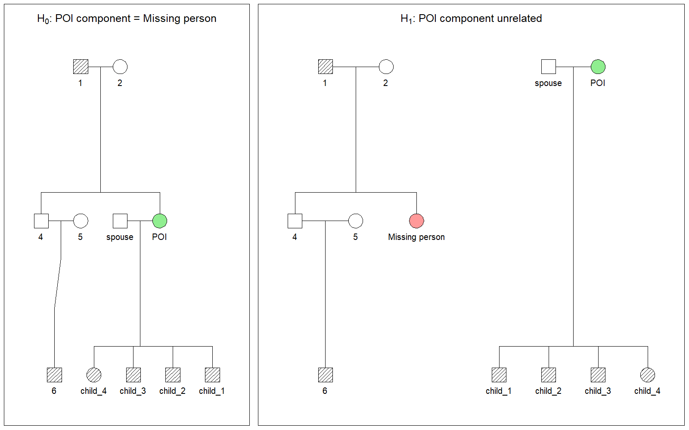
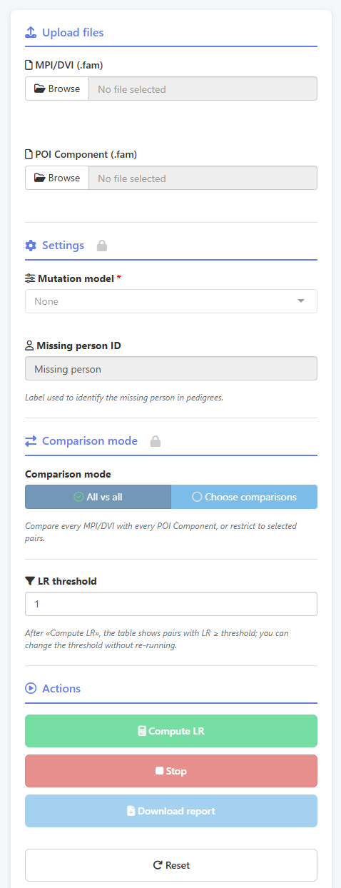
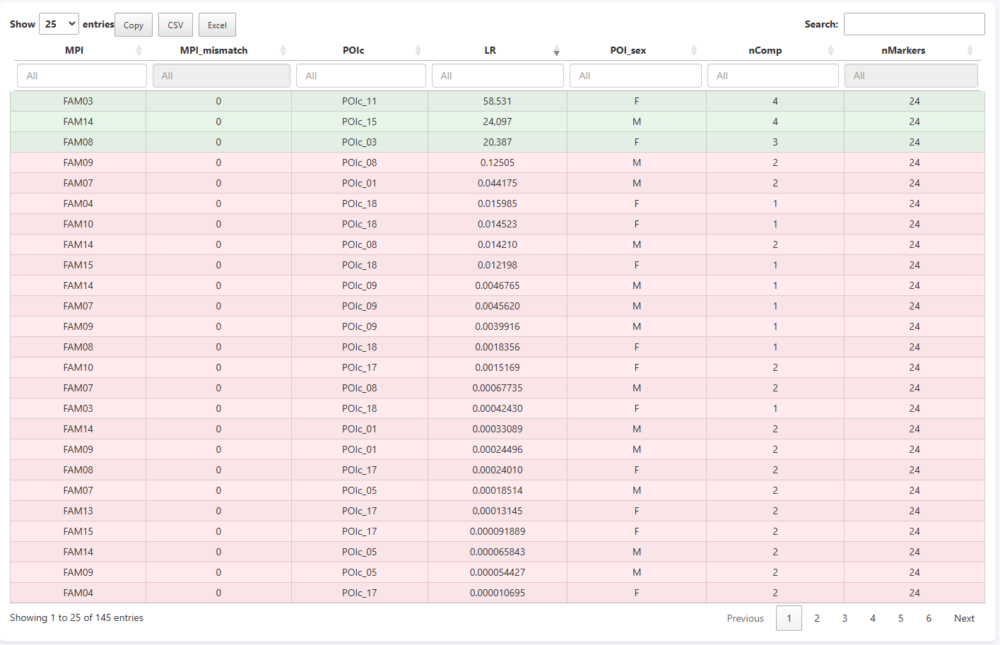

## 🧬 Introduction


In humanitarian and forensic genetics, one of the most computationally tedious problems
is also one of the most consequential: systematically comparing a set of reference family
pedigrees against a set of candidate biological relatives to find which pairs are actually
related to the same missing person. This is the core challenge of
**Missing Person Identification (MPI)** and **Disaster Victim Identification (DVI)** workflows.

A defining constraint in all these scenarios is that **the person of interest is not always genotyped**.
They may be deceased and unidentified, disappeared, suspected of theft and identity swap,
or simply unwilling to provide a biological sample — or their remains may have been
cremated or commingled in an ossuary, making individual sampling no longer possible.
The analysis must therefore rely exclusively on the genotypes of their relatives —
making indirect kinship inference the only available path to identification.

Most forensic geneticists working in this area are familiar with **Familias3**. It is an excellent,
free, well-validated software platform for kinship evaluation — and it remains the standard
for pedigree construction and allele frequency management in forensic genetics. What is not
fully implemented in Familias3, however, is a mechanism for systematically running every
MPI/DVI family against every POI Component (**Person Of Interest Component**) in a
comparison workflow in an all-vs-all.

That gap is exactly what **KinshipAssembly** was designed to close.


---

## ⚖️ Statistical Hypothesis Testing between MPI/DVI families and POI Components

To understand why a dedicated application is necessary, it helps to consider the specific
scenario KinshipAssembly is designed for — one where
**no direct reference profile is available on either side**.

You work with two collections of pedigrees:

- **MPI/DVI families**: families of missing or deceased individuals. Each pedigree contains
  typed reference relatives (parents, siblings, children) with an untyped node representing
  the missing person whose identity is being sought.

- **POI Components**: family groups associated with a candidate. The POI themselves does
  not have a direct genotype profile available — what is available are the genotypes of
  their relatives. The "Component" reflects precisely this: kinship evidence assembled
  around a candidate who cannot or did not provide a sample directly.

The investigative question is: *does this POI Component correspond to this missing person?*
Formally, this is evaluated via a **Likelihood Ratio (LR)**:

$$
LR = \frac{P(\text{genetic data} \mid H_0)}{P(\text{genetic data} \mid H_1)}
$$

where:

- **H₀** (*relatedness hypothesis*): the POI **is** the missing person. The two pedigrees
  are merged structurally — the untyped missing-person node and the untyped POI node are
  treated as the same individual. Neither has a direct genotype profile; the evidence comes
  entirely from the typed relatives on both sides, evaluated as a single connected pedigree.

- **H₁** (*unrelatedness hypothesis*): the POI is **unrelated** to the missing person.
  Both pedigrees remain independent, and the data are evaluated separately with no
  structural connection.



---

## 🔬 What KinshipAssembly Does

**KinshipAssembly** is a browser-based **Shiny** application (R) built around
`forrel::kinshipLR()` from the **pedsuite** ecosystem. Its core innovation is
workflow-level, not statistical.

The key design decisions for this application are:

### 📁 Dual-file architecture with Familias3 pedigrees

The app accepts two `.fam` files — one for the MPI/DVI collection and one for the
POI Components (both configured in the DVI/MPI module). This means you work entirely
within the **Familias3** ecosystem for pedigree construction and allele frequency
management, then hand off to KinshipAssembly for the computation of the LR.

### 🔄 Mutation modelling built into the app

Three mutation models are available: **None**, **Equal**, and **Extended stepwise**
(with configurable rate and range). This is particularly important when working with
degraded samples or older pedigrees where mutation events are more likely.

### ⚙️ All-vs-all or targeted comparisons

You can choose between **all-vs-all** (every MPI/DVI family tested against every
POI Component) or a **targeted** mode where you manually select specific pairs.

### 🎯 LR threshold filtering without recalculation

After running a comparison, you can adjust the **LR threshold** slider to hide pairs
below any cutoff — without triggering a new computation.

### 🔎 Detailed Pairwise Analysis

Every row in the results table is clickable. Selecting a pair opens a detail panel showing:

- Side-by-side **pedigree hypothesis plots** (H₀ and H₁)
- A **per-marker LR table** with genotypes for all typed relatives
- Direct downloads for the pedigree image (PNG) and the per-marker data (CSV)

This is where the statistical work becomes interpretable.

---

## 🖥️ A Walkthrough with Real Output

A synthetic toy dataset with 15 MPI reference families and 20 POI Components with
24 STR markers was built to demonstrate the application's functionality. The following
screenshots show the application running on this dataset.

### Loading data and configuring the run

Both `.fam` files are uploaded via the sidebar. The app confirms the pedigree count
for each file and activates the analysis controls. Here the mutation model is set to
**None**, the missing person label matches the untyped node in the pedigree, and the
comparison mode is **All vs all**. By default, the LR threshold is set to 1.



### Results table after comparison

After clicking **Compute LR**, the Comparisons tab displays a table with one row per
pair. Each row reports:

| Column         | Meaning                                               |
| -------------- | ----------------------------------------------------- |
| `MPI`          | MPI/DVI family name                                   |
| `MPI_mismatch` | Mendelian inconsistencies within the MPI/DVI pedigree |
| `POIc`         | POI Component family name                             |
| `LR`           | Total likelihood ratio for this pair                  |
| `POI_sex`      | Recorded sex of the POI (M / F / UNK)                 |
| `nComp`        | Number of typed relatives in the POI Component        |
| `nMarkers`     | Number of STR markers used after harmonisation        |

Results are sorted by LR in descending order, immediately surfacing the most evidentially
supported pairs. In this toy dataset, **FAM03 vs POIc_11** tops the table with LR = 58.531
across 24 markers, with 4 typed relatives in the POI branch — a relatively strong result
for a pedigree of this complexity.



### Comparison detail: pedigrees hypotheses and per-marker LRs

Clicking the FAM03 vs POIc_11 row opens the detail panel. On the left, the H₀ pedigree
shows the merged structure — the POI is positioned as the missing person within FAM03.
On the right, H₁ shows both families as completely independent units. Below the plots,
a per-marker breakdown lists the LR contribution of each locus, alongside the genotypes
of every typed individual.

This view is what makes the output verified: you can immediately see which markers are
driving the LR upward (D2S1338 at 5.585, D7S820 at 2.816) and which are near-neutral
(D3S1358 at 0.999), and verify genotype consistency.


---

## 🌍 When Is This Tool Relevant?

KinshipAssembly is designed for cases where **families need to be reunified but no direct
biological sample is available from the person being sought** — and where the scale of the
investigation makes manual one-by-one comparisons impractical. It is most applicable in:

- **Mass grave investigations**: forensic teams working on mass grave cases typically have
  two growing collections — reference families reporting a missing person, and POI Components
  assembled from candidate individuals found at or near the site. Neither the missing person
  nor the candidate has a direct genotype available; identification must go through their
  relatives on both sides, and the number of combinations to evaluate quickly becomes
  unmanageable without automated processing.

- **Post-disaster investigations**: aircraft accidents, natural disasters, or conflict events
  generate many unidentified victims and many reference families simultaneously. On one side,
  families reporting a missing person form the MPI collection; on the other, POI Components
  are assembled from candidates whose relatives have come forward. In both cases no direct
  profile is available — only the genotypes of relatives — and the volume of cross-comparisons
  quickly requires automated processing.

- **Identity substitution investigations**: cases where a living individual is suspected
  of having assumed another person's identity. The MPI family is the family of the person
  whose identity may have been taken; the POI Component is assembled from the relatives of
  the individual under suspicion — who may be alive but unwilling to provide a biological
  sample, or may be deceased. Neither side provides a direct profile from the person at
  the centre of the case, and a systematic all-vs-all comparison is needed to evaluate
  every possible pairing.

---

## 🛠️ Technical Stack

KinshipAssembly is built entirely in **R** using the following packages:

- **Computation**: `forrel::kinshipLR`, `pedtools`, `pedFamilias`, `pedmut`
- **Interface**: `shiny`, `shinyjs`, `shinyWidgets`, `DT`
- **Data manipulation**: `dplyr`, `purrr`, `tibble`, `stringr`

The application requires **R ≥ 4.5.0** and accepts `.fam` files generated by Familias3
(available at [familias.no](https://familias.no/)). The upload limit is set to
**100 MB per request** to accommodate large pedigree collections.

The full source code is available on GitHub:

```bash
git clone https://github.com/sbiagini0/KinshipAssembly.git
```

---

## 💡 Concluding Remarks

The statistical foundations of forensic kinship analysis — Bayesian likelihood ratios,
mutation models, pedigree-aware genotype probability calculations — are well-established
and implemented in pedigree-based packages. Building on these foundations,
**KinshipAssembly** provides a workflow that systematically compares MPI/DVI families
with POI Components in an all-vs-all comparison at large scale.

It is built around the fundamental reality of these cases: the person of interest cannot
provide a sample, so identification must be achieved entirely through indirect kinship
inference from relatives on both sides. It does not introduce new statistical methods;
it makes existing, validated methods accessible at the scale that real-world humanitarian
and forensic investigations require, through a browser-based interface that integrates
directly with the Familias3 pedigree format that most forensic geneticists already use.

---

## 📚 References

- **Vigeland, M. D.** (2020). *Pedigree Analysis in R*. Academic Press. https://doi.org/10.1016/C2020-0-01956-0
- **Familias3** software: https://familias.no/
