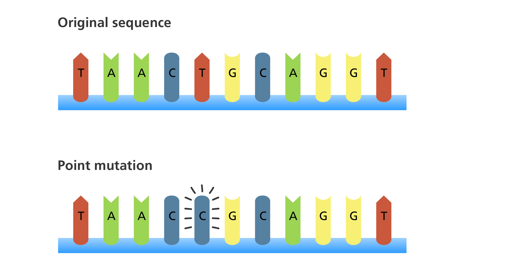
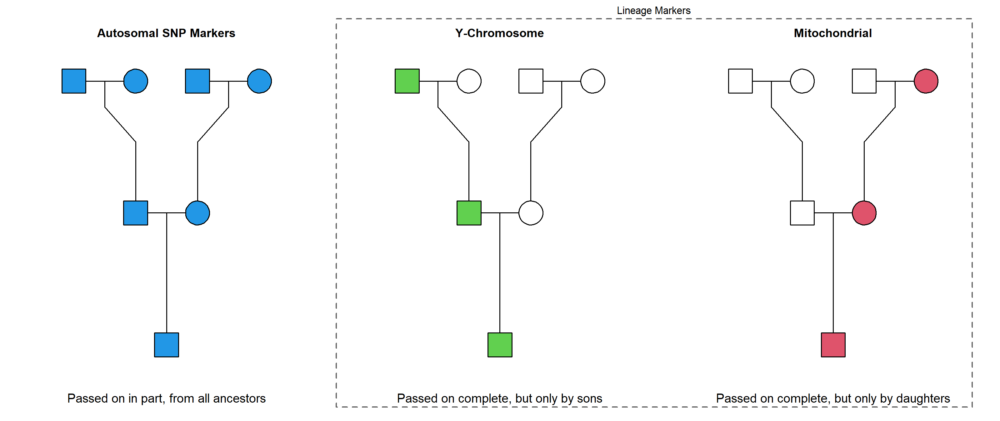
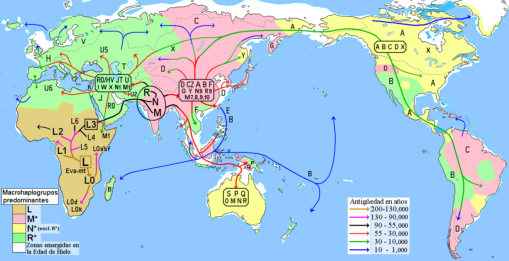
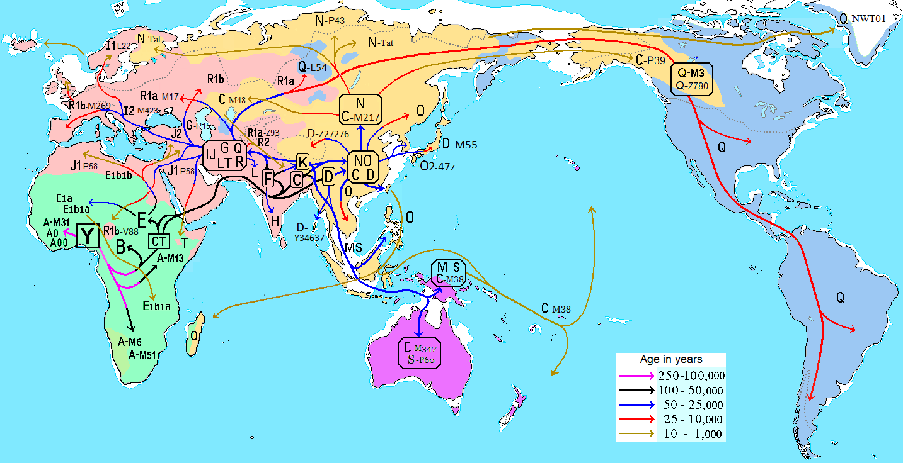
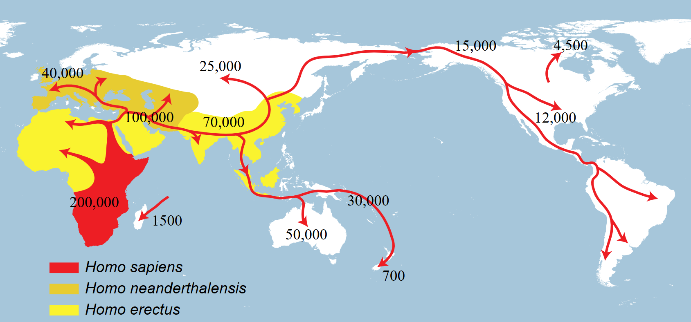
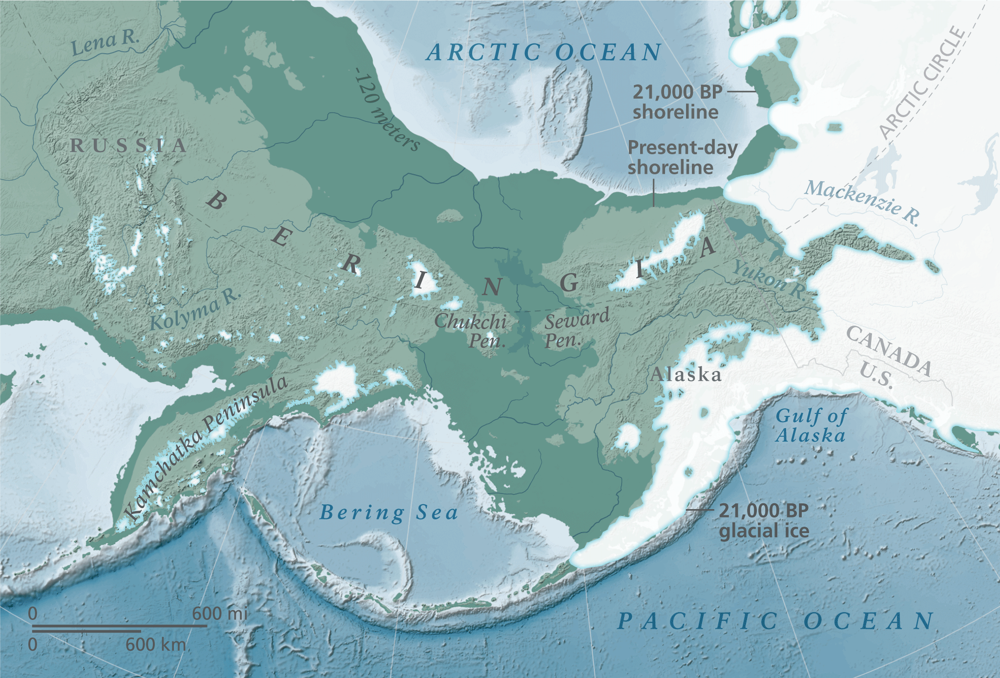

```{r setup, include=FALSE}
knitr::opts_chunk$set(echo = FALSE, message = FALSE, warning = FALSE)
library(htmltools)
doc_dir <- dirname(normalizePath(knitr::current_input()))
```

```{r fullwidth_with_toc, results='asis', echo=FALSE}
cat('
<style>
  /* Expandir contenedor principal */
  div.main-container, .page-inner {
    max-width: 100% !important;
    width: 100% !important;
  }

  /* Mantener TOC flotante visible y estrecho */
  .tocify, .tocify-wrapper {
    display: block !important;
    width: 16rem !important;           /* ancho de la barra de TOC */
  }
  .tocify {
    max-height: calc(100vh - 2rem);     /* que no se corte en pantallas bajas */
    overflow: auto;
  }

  /* Dar espacio al contenido a la derecha del TOC */
  .toc-content {
    width: auto !important;
    max-width: 100% !important;
    margin-left: 17rem !important;      /* ~ ancho TOC + 1rem de margen */
  }

  /* Quitar paddings globales para aprovechar el ancho */
  .container, .container-fluid, .main-container {
    padding-left: 0 !important;
    padding-right: 0 !important;
  }

  /* Figuras/iframes/widgets a ancho completo del contenedor de contenido */
  img, iframe, .html-widget, .html-widget-static-boundaries {
    max-width: 100% !important;
    width: 100% !important;
  }

  @media (max-width: 992px) {
    .tocify, .tocify-wrapper {
      display: block !important;
      position: static !important;
      width: 100% !important;
      max-height: none !important;
      margin-bottom: 1rem;
    }
    .toc-content { margin-left: 0 !important; }
  }
</style>
')

```

# ⏳🧬 The Timescale of Mutations

Mutations are changes in the DNA sequence that occur due to errors in replication or the action of environmental factors. They can be single base substitutions, insertions or deletions of fragments, or larger rearrangements. Most are neutral and do not directly affect the organism, but they are transmitted to offspring and accumulate over time. These mutations are the **primary source of genetic variability**, and their effects are complemented by other fundamental processes in population genetics:  

- **Genetic recombination**, which shuffles variants during gamete formation and generates new allelic combinations in each generation.  
- **Natural selection**, which favors beneficial variants and eliminates harmful ones, adapting populations to their environment.  
- **Genetic drift**, random changes in allele frequencies, especially marked in small populations.  
- **Gene flow**, the exchange of variants between populations through migration and interbreeding.  
- **Founder effect and bottlenecks**, drastic reductions in genetic variability due to founding by a limited number of individuals or demographic crises.  

The interaction among these processes, acting on accumulated mutations, explains the genetic diversity observed in the human species and allows us to reconstruct evolutionary history across time and space. 

{width=100%}
*Source: Wellcome Genome Campus, "DNA mutations – point mutation".*  
[Link to image](https://www.yourgenome.org/resources/animation/dna-mutations) – Licensed under [CC BY 4.0](https://creativecommons.org/licenses/by/4.0/).  

---

# 🔁⚙️ Genetic Variability as a Driver of Change  

Throughout the history of *Homo sapiens*, evolutionary processes interacted with **natural barriers**—deserts, mountain ranges, forests, and oceans—that limited contact between populations. Isolation promoted differentiation through drift, while migrations opened routes for gene flow and admixture, acting on standing and newly arisen **variation**.  

In this context, maternal lineages (**mitochondrial DNA**) and paternal lineages (**Y chromosome**) allow us to trace direct lines of inheritance, while autosomal **SNPs** reflect the complete genetic mosaic resulting from the combination of both parental contributions. Studied together, these markers provide an integrated view of how our species originated in Africa and expanded across the globe, accumulating genetic variability over time and space.  

{width=100%}
*Figure created by the author with **pedtools** [Vigeland, 2020].*

---

# 🧬 Mitochondrial Eve and Y-Chromosomal Adam: Markers of Origin  

The concepts of **“Mitochondrial Eve”** and **“Y-Chromosomal Adam”** are used in population genetics to describe the most recent common ancestors of our maternal and paternal lines, respectively.  

- **Mitochondrial DNA (mtDNA)** is inherited exclusively through the maternal line: each person receives their mitochondria from their mother, and she from hers, in an unbroken chain. Thus, all living humans share a common maternal ancestor —the so-called *Mitochondrial Eve*— who lived in Africa between **150,000 and 200,000 years ago**, represented by haplogroup L.  

{width=100%}
*Source: Wikipedia contributors. "Human mitochondrial DNA haplogroup."*  
[Link to image](https://es.wikipedia.org/wiki/Haplogrupos_de_ADN_mitocondrial_humano#/media/Archivo:Migraciones_humanas_en_haplogrupos_mitocondriales.PNG) – Licensed under [CC BY-SA 3.0](https://creativecommons.org/licenses/by-sa/3.0/).  

- The **Y chromosome**, present only in males, is passed from fathers to sons without recombining with the X chromosome, except through the accumulation of mutations over time. This allows tracing a continuous male lineage back to a common ancestor: the *Y-Chromosomal Adam*, who lived in Africa about **100,000 to 250,000 years ago**.  

{width=100%}
*Source: Wikipedia contributors. "Human Y-chromosome haplogroups."*  
[Link to image](https://en.wikipedia.org/wiki/File:Migraciones_humanas_en_haplogrupos_de_ADN-Y.PNG) – Licensed under [CC BY-SA 3.0](https://creativecommons.org/licenses/by-sa/3.0/). 

These two modes of inheritance —maternal and paternal— act as direct lines that preserve mutations over time, serving as “markers of origin.” By analyzing them, it is possible to reconstruct how human populations diverged, crossed natural barriers, and expanded through migrations, giving rise to today’s diversity.  

---

# 🗺️🧭 Routes and Barriers: The Expanding Map  

### African Origin and Initial Diversification  

Anatomically modern *Homo sapiens* arose in Africa around **200,000 years ago**. For tens of thousands of years, human populations remained structured within Africa. Ecological fragmentation (savannah, Sahara desert, tropical forests) created **geographic barriers** that limited gene flow between groups. As a result, population differentiation was accentuated through genetic drift: random changes in allele frequencies due to small population sizes and stochastic transmission across generations.  

{width=100%}
*Source: Wikipedia contributors. "Spreading Homo sapiens Latin America."*  
[Link to image](https://en.wikipedia.org/wiki/File:Spreading_homo_sapiens_la.svg) – Licensed under [CC BY-SA 3.0](https://creativecommons.org/licenses/by-sa/3.0/).

### Out of Africa and Expansion into Eurasia  

Around **60,000–70,000 years ago**, a subset of African lineages carrying defining mutations in **mtDNA (haplogroup L3)** and the **Y chromosome (haplogroups C, D, and F, derived from African A and B)** crossed northeastern Africa into the Middle East.  

The main route followed the coast of the Red Sea and the Arabian Peninsula, where contact with new environments favored population bottlenecks that intensified genetic drift.  

- From the **Middle East**, populations split:  
  - Some advanced into **Europe about 45,000 years ago**, largely replacing Neanderthals, though with evidence of **gene flow** from them (~1–2% of the current non-African genome derives from Neanderthals).  
  - Others moved into **Central and East Asia**, accumulating mutations that defined regional haplogroups (e.g., mtDNA M and N; Y haplogroups O and C).  

- **Geography played a crucial role** in population structure:  
  - Mountain ranges such as the **Caucasus, Himalayas, Urals, and Carpathians**, and deserts such as the **Sahara, Gobi, Taklamakan, Karakum, and Kyzylkum**, limited direct contact between populations and promoted differentiation through isolation.  
  - Other barriers included the cold **Siberian steppes**, the **Iranian plateau**, and the **Thar desert** in India.  
  - Inland seas such as the **Caspian Sea, Black Sea, and Aral Sea**, as well as the **eastern Mediterranean**, sometimes acted as obstacles and sometimes as corridors of dispersal, depending on navigational technology.  
  
{width=100%}
*Source: Wikipedia contributors. "Expansion of early modern humans from Africa."*  
[Link to image](https://en.wikipedia.org/wiki/File:Expansion_of_early_modern_humans_from_Africa.jpg) – Licensed under [CC BY-SA 3.0](https://creativecommons.org/licenses/by-sa/3.0/).


### Expansion into Oceania and the Americas  

In parallel, other groups moved into **Southeast Asia and Oceania**, reaching **Australia at least 50,000 years ago**. The colonization of these regions reflects both the accumulation of unique mutations in isolated lineages and the action of genetic drift in small founding populations.  

Finally, between **20,000 and 15,000 years ago**, descendants of Siberian populations crossed the **Bering Strait** during the Last Glacial Maximum, when sea levels were lower. From there they expanded rapidly into North and South America. The colonization of the Americas illustrates a classic case of the **founder effect**: small groups carrying only a fraction of the original genetic variability, whose drift accentuated the relative homogeneity of Native American populations.  

{width=100%}
*Source: Wikimedia Commons. "Map of Beringia Bathymetry."*  
[Link to image](https://commons.wikimedia.org/wiki/File:Beringia-Map_Bathymetry_web72_final.png) – Licensed under [CC BY-SA 3.0](https://creativecommons.org/licenses/by-sa/3.0/).

---

# 🌐📊 The Modern Landscape of Human Genetic Diversity 

The study of **genetic ancestry** seeks to reconstruct human population history through inherited variations in our DNA. Among the most widely used markers are **SNPs (Single Nucleotide Polymorphisms)**, small single-base changes in the genome that, once accumulated and transmitted, reflect the species’ diversity.  

SNPs are used as ancestry markers because:  
- They represent the **combined contribution of paternal and maternal inheritance**, being located on autosomes.  
- They reveal patterns of **population differentiation** resulting from mutations, drift, bottlenecks, and geographic isolation.  
- Analyzed together, they make it possible to reconstruct **migration trajectories and admixture processes**, offering a global view of current human genetic variability.  

Thus, SNPs represent the **complete genetic mosaic** of each individual and have become the foundation of modern studies of human evolution and migration history.  

If we follow the logic of anatomically modern humans originating in Africa and tracing their migratory routes through mutations as shown above—a pattern that can also be reproduced by analyzing 192 ancestry-informative SNPs across 79 modern populations—the **African cluster** emerges as the starting point of our species, from which the expansion into the **Middle East and Europe** forms intermediate groupings, while further away, yet still connected, the clusters of **Southeast Asia, Oceania, and East Asia** reflect those coastal eastward expansions

```{r pca1, echo=FALSE, results='asis', message=FALSE, warning=FALSE}
pca_path1 <- file.path(doc_dir, "assets", "pca3d_refs.html")
includeHTML(pca_path1)

```
*PCA plot created by the author using Python and the **Matplotlib** library.*

> 
> The PCA summarizes the genetic variation of markers into a few axes. Each axis represents a combination of variants that maximizes population
> differences. In a **3D PCA**, the first three principal components are shown as spatial axes, and each point corresponds to a population. 
> This provides a more complete visualization of global genetic structure: how human groups cluster, separate, or connect according to
> their evolutionary history and migrations.
>

In contrast, the **American cluster** appears isolated and without direct connection to other continents. This evolutionary separation is explained by the fact that Native American populations descend from a reduced number of founders who crossed the **Bering Strait**. The subsequent long geographic isolation, together with the founder effect and drift, reduced variability and created a distinctive genetic profile. For this reason, in the PCA, the Americas appear far from Eurasia and Africa, showing a signature of isolation and differentiation that persisted until European colonization in 1492. 

---

# 🚢🔗 European Impact and the Admixture of the Americas

The arrival of Europeans in the Americas from the 16th century onwards marked a turning point in the continent’s genetic history. Invasion and colonization involved not only political and cultural domination but also a profound **reconfiguration of the genetic pool** of American populations. With transoceanic navigation, the **geographic barriers** that had kept the continent isolated for tens of thousands of years were broken, allowing the entry of European and African lineages which, mixing with Native peoples, gave rise to new **admixed populations** across the continent.  

Three major currents shaped this transformation:  
- **European colonizers**, mainly from the Iberian Peninsula, who introduced lineages characteristic of Western Europe.  
- The **transatlantic slave trade**, which forcibly transported millions of people from Africa, incorporating African genetic diversity in different parts of the Americas.  
- The **Native peoples**, whose prior genetic heritage remained a central component, although in many cases diminished by massive mortality and demographic marginalization.  

In addition, massive European migrations between the 19th and 20th centuries brought millions of Italians, Spaniards, Portuguese, Germans, and other groups to the Americas. These flows, directed mainly toward North America and the Southern Cone, further reinforced the European genetic component and increased the diversity of admixture patterns observed today in countries such as the United States, Argentina, Brazil, and Uruguay

The result was the formation of **admixed populations** with varying degrees of European, African, and Native American contributions, which still define much of the genetic diversity in Latin America today.  

```{r pca2, echo=FALSE, results='asis', message=FALSE, warning=FALSE}
pca_path2 <- file.path(doc_dir, "assets", "pca3d_admixed.html")
includeHTML(pca_path2)

```
*PCA plot created by the author using Python and the **Matplotlib** library.*

> 
> This PCA shows both reference populations (represented as groupings of individuals) and simulated individuals (each grey point) from Argentina, 
> contrasted with real data that cannot be displayed here due to ethical and confidentiality considerations. 
>

In the PCA, this admixture is reflected in the appearance of intermediate points between the European and American clusters. By incorporating **250 simulated individuals** representing the admixed population of Argentina, the graph shows a large cluster oriented toward Europe but extended toward America, **filling the previous gap between the two continents**. This pattern is particularly evident because the analysis compares population groupings with individual-level data, making the genetic continuity stand out more clearly as admixture acts as an **evolutionary bridge** connecting lineages that had been isolated for millennia. 

---

# 🧠 Reflection and Future Perspectives  

The genetic history of *Homo sapiens* is the history of its **mutations, migrations, and admixtures**. Each inherited variation functions as a record of the past, allowing us to reconstruct how our species left Africa, crossed natural barriers, and populated every continent. The European colonization of the Americas, with the incorporation of European and African lineages into the Native genetic pool, shows that in just a few centuries, population structures that had remained stable for millennia can be profoundly transformed — a process later reinforced by the massive waves of European immigration during the 19th and 20th centuries, which further reshaped the genetic landscape of the continent.

Looking to the future, the advance of globalization and human mobility could suggest that the **well-defined clusters** we see today in a PCA might tend to blur. Populations would become increasingly mixed and homogeneous on a global scale, while **genetic technologies** (from personalized medicine to gene editing) could generate new forms of variability and differentiation. It is possible that in a few hundred years the human genetic map would show fewer biological boundaries, but perhaps new divisions might emerge based on cultural or technological choices.

In short, human evolution does not stop: it will continue to be the result of the interaction between **mutations** and **social processes** which, as in the past, will keep shaping our diversity.  

---

# 📚 References

- Hamilton, M. B. (2009). *Population genetics*. Wiley-Blackwell.
- Relethford, J. H. (2016). *Human Population Genetics*. Wiley-Blackwell.
- Vigeland MD (2021). *Pedigree Analysis in R*. Academic Press. ISBN 978-0128244302. 
- Pakstis, A. J., & Kidd, K. K. (n.d.). *FROG-kb: 192 SNPs combined ancestry informative marker dataset (192CombinedAI_aFreq.txt)* [Data set]. Yale University.  
  Available at: [https://frog.med.yale.edu/FrogKB/freqdownload/192CombinedAI_aFreq.txt](https://frog.med.yale.edu/FrogKB/freqdownload/192CombinedAI_aFreq.txt) 
  
---