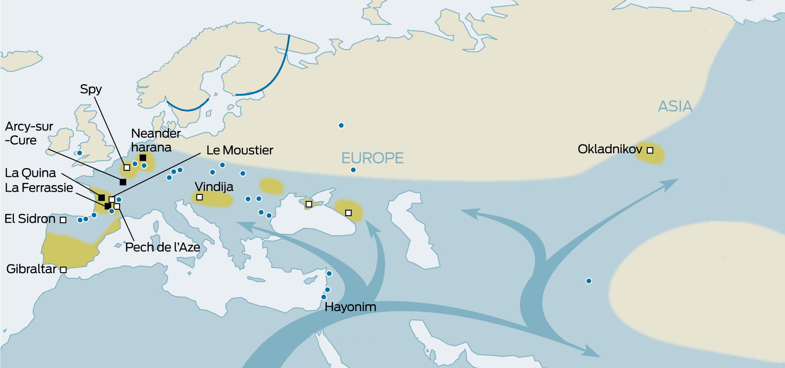

# ⏳🧬 The Timescale of Mutations

Mutations are changes in the DNA sequence that occur due to errors in
replication or the action of environmental factors. They can be single
base substitutions, insertions or deletions of fragments, or larger
rearrangements. Most are neutral and do not directly affect the
organism, but they are transmitted to offspring and accumulate over
time. These mutations are the **primary source of genetic variability**,
and their effects are complemented by other fundamental processes in
population genetics:

- **Genetic recombination**, which shuffles variants during gamete
  formation and generates new allelic combinations in each generation.  
- **Natural selection**, which favors beneficial variants and eliminates
  harmful ones, adapting populations to their environment.  
- **Genetic drift**, random changes in allele frequencies, especially
  marked in small populations.  
- **Gene flow**, the exchange of variants between populations through
  migration and interbreeding.  
- **Founder effect and bottlenecks**, drastic reductions in genetic
  variability due to founding by a limited number of individuals or
  demographic crises.

The interaction among these processes, acting on accumulated mutations,
explains the genetic diversity observed in the human species and allows
us to reconstruct evolutionary history across time and space.

 *Source: Wellcome
Genome Campus, “DNA mutations – point mutation”.*  
[Link to
image](https://www.yourgenome.org/resources/animation/dna-mutations) –
Licensed under [CC BY
4.0](https://creativecommons.org/licenses/by/4.0/).

------------------------------------------------------------------------

# 🔁⚙️ Genetic Variability as a Driver of Change

Throughout the history of *Homo sapiens*, evolutionary processes
interacted with **natural barriers**-deserts, mountain ranges, forests,
and oceans-that limited contact between populations. Isolation promoted
differentiation through drift, while migrations opened routes for gene
flow and admixture, acting on standing and newly arisen **variation**.

In this context, **mitochondrial DNA** (maternal lineages) and **Y chromosome** 
(paternal lineages) allow us to trace direct lines of
inheritance, while autosomal **SNPs** reflect the complete genetic
mosaic resulting from the combination of both parental contributions.
Studied together, these markers provide an integrated view of how our
species originated in Africa and expanded across the globe, accumulating
genetic variability over time and space.

 *Figure
created by the author with **pedtools** \[Vigeland, 2020\].*

------------------------------------------------------------------------

# 🌍🧬 Mitochondrial Eve and Y-Chromosomal Adam: Markers of Origin

The concepts of **“Mitochondrial Eve”** and **“Y-Chromosomal Adam”** are
used in population genetics to describe the most recent common ancestors
of our maternal and paternal lines, respectively.

- **Mitochondrial DNA (mtDNA)** is inherited exclusively through the
  maternal line: each person receives their mitochondria from their
  mother, and she from hers, in an unbroken chain. Thus, all living
  humans share a common maternal ancestor -the so-called *Mitochondrial
  Eve*- who lived in Africa between **150,000 and 200,000 years ago**,
  represented by haplogroup L.

 *Source:
Wikipedia contributors. “Human mitochondrial DNA haplogroup.”*  
[Link to
image](https://es.wikipedia.org/wiki/Haplogrupos_de_ADN_mitocondrial_humano#/media/Archivo:Migraciones_humanas_en_haplogrupos_mitocondriales.PNG)
– Licensed under [CC BY-SA
3.0](https://creativecommons.org/licenses/by-sa/3.0/).

- The **Y chromosome**, present only in males, is passed from fathers to
  sons without recombining with the X chromosome, except through the
  accumulation of mutations over time. This allows tracing a continuous
  male lineage back to a common ancestor: the *Y-Chromosomal Adam*, who
  lived in Africa about **100,000 to 250,000 years ago**.

 *Source: Wikipedia
contributors. “Human Y-chromosome haplogroups.”*  
[Link to
image](https://en.wikipedia.org/wiki/File:Migraciones_humanas_en_haplogrupos_de_ADN-Y.PNG)
– Licensed under [CC BY-SA
3.0](https://creativecommons.org/licenses/by-sa/3.0/).

These two modes of inheritance -**maternal and paternal**- act as direct
lines that preserve mutations over time, serving as “markers of origin.”
By analyzing them, it is possible to reconstruct how human populations
diverged, crossed natural barriers, and expanded through migrations,
giving rise to today’s diversity.

------------------------------------------------------------------------

# 🗺️🧭 Routes and Barriers: The Expanding Map

### African Origin and Initial Diversification

Anatomically modern *Homo sapiens* arose in Africa around **200,000
years ago**. For tens of thousands of years, human populations remained
structured within Africa. Ecological fragmentation (savannah, Sahara
desert, tropical forests) created **geographic barriers** that limited
gene flow between groups. As a result, population differentiation was
accentuated through genetic drift: random changes in allele frequencies
due to small population sizes and stochastic transmission across
generations.

*Source: Wikipedia contributors. “Spreading Homo sapiens Latin America.”*  

[Link to image](https://en.wikipedia.org/wiki/File:Spreading_homo_sapiens_la.svg)
– Licensed under [CC BY-SA
3.0](https://creativecommons.org/licenses/by-sa/3.0/).

### Out of Africa and Expansion into Eurasia

Around **60,000–70,000 years ago**, a subset of African lineages
carrying defining mutations in **mtDNA (haplogroup L3)** and the **Y
chromosome (haplogroups C, D, and F, derived from African A and B)**
crossed northeastern Africa into the Middle East.

The main route followed the coast of the Red Sea and the Arabian
Peninsula, where contact with new environments favored population
bottlenecks that intensified genetic drift.

- From the **Middle East**, populations split:
  - Some advanced into **Europe about 45,000 years ago**, largely
    replacing Neanderthals, though with evidence of **gene flow** from
    them (~1–2% of the current non-African genome derives from
    Neanderthals).  
  - Others moved into **Central and East Asia**, accumulating mutations
    that defined regional haplogroups (e.g., mtDNA M and N; Y
    haplogroups O and C).
- **Geography played a crucial role** in population structure:
  - Mountain ranges such as the **Caucasus, Himalayas, Urals, and
    Carpathians**, and deserts such as the **Sahara, Gobi, Taklamakan,
    Karakum, and Kyzylkum**, limited direct contact between populations
    and promoted differentiation through isolation.  
  - Other barriers included the cold **Siberian steppes**, the **Iranian
    plateau**, and the **Thar desert** in India.  
  - Inland seas such as the **Caspian Sea, Black Sea, and Aral Sea**, as
    well as the **eastern Mediterranean**, sometimes acted as obstacles
    and sometimes as corridors of dispersal, depending on navigational
    technology.

 *Source: Wikipedia
contributors. “Expansion of early modern humans from Africa.”*  
[Link to
image](https://en.wikipedia.org/wiki/File:Expansion_of_early_modern_humans_from_Africa.jpg)
– Licensed under [CC BY-SA
3.0](https://creativecommons.org/licenses/by-sa/3.0/).

### Expansion into Oceania and the Americas

In parallel, other groups moved into **Southeast Asia and Oceania**,
reaching **Australia at least 50,000 years ago**. The colonization of
these regions reflects both the accumulation of unique mutations in
isolated lineages and the action of genetic drift in small founding
populations.

Finally, between **20,000 and 15,000 years ago**, descendants of
Siberian populations crossed the **Bering Strait** during the Last
Glacial Maximum, when sea levels were lower. From there they expanded
rapidly into North and South America. The colonization of the Americas
illustrates a classic case of the **founder effect**: small groups
carrying only a fraction of the original genetic variability, whose
drift accentuated the relative homogeneity of Native American
populations.

 *Source:
Wikimedia Commons. “Map of Beringia Bathymetry.”*  
[Link to
image](https://commons.wikimedia.org/wiki/File:Beringia-Map_Bathymetry_web72_final.png)
– Licensed under [CC BY-SA
3.0](https://creativecommons.org/licenses/by-sa/3.0/).

------------------------------------------------------------------------

# 🌐📊 The Modern Landscape of Human Genetic Diversity

The study of **genetic ancestry** seeks to reconstruct human population
history through inherited variations in our DNA. Among the most widely
used markers are **SNPs (Single Nucleotide Polymorphisms)**, small
single-base changes in the genome that, once accumulated and
transmitted, reflect the species’ diversity.

SNPs are used as ancestry markers because:  
- They represent the **combined contribution of paternal and maternal
inheritance**, being located on autosomes.  
- They reveal patterns of **population differentiation** resulting from
mutations, drift, bottlenecks, and geographic isolation.  
- Analyzed together, they make it possible to reconstruct **migration
trajectories and admixture processes**, offering a global view of
current human genetic variability.

Thus, SNPs represent the **complete genetic mosaic** of each individual
and have become the foundation of modern studies of human evolution and
migration history.

If we follow the logic of **anatomically modern humans** originating in
Africa and tracing their migratory routes through mutations as shown
above-a pattern that can also be reproduced by analyzing 192
ancestry-informative SNPs across 79 modern populations-the **African
cluster** emerges as the starting point of our species, from which the
expansion into the **Middle East and Europe** forms intermediate
groupings, while further away, yet still connected, the clusters of
**Southeast Asia, Oceania, and East Asia** reflect those coastal
eastward expansions.

  <iframe
    src="/pca/pca3d_refs.html"
    title="PCA 3D — Populations"
    style="display:block;width:100%;height:580px;border:0;overflow:hidden"
    loading="lazy" allowfullscreen scrolling="no">
  </iframe>

*Interactive 3D PCA created by the author with Python. PCA computed using scikit-learn on a standardized allele-dosage matrix; visualization rendered with Plotly*

> A PCA reduces genetic variation into three axes. Each point represents a population; 
> if you hover over a point, you’ll see its name and PCA coordinates. 
> You can also toggle populations on and off in the legend to explore the structure interactively

In contrast, the **American cluster** appears isolated and without
direct connection to other continents. This evolutionary separation is
explained by the fact that Native American populations descend from a
reduced number of founders who crossed the **Bering Strait**. The
subsequent long geographic isolation, together with the founder effect
and drift, reduced variability and created a distinctive genetic
profile. For this reason, in the PCA, the Americas appear far from
Eurasia and Africa, showing a signature of isolation and differentiation
that persisted until European colonization in 1492.

------------------------------------------------------------------------

# 🚢🔗 European Impact and the Admixture of the Americas

The arrival of Europeans in the Americas from the 16th century onwards
marked a turning point in the continent’s genetic history. Invasion and
colonization involved not only political and cultural domination but
also a deep **reconfiguration of the genetic pool** of American
populations. With transoceanic navigation, the **geographic barriers**
that had kept the continent isolated for tens of thousands of years were
broken, allowing the entry of European and African lineages which,
mixing with Native peoples, gave rise to new **admixed populations**
across the continent.

Three major currents shaped this transformation:  
- **European colonizers**, mainly from the Iberian Peninsula, who
introduced lineages characteristic of Western Europe.  
- The **transatlantic slave trade**, which forcibly transported millions
of people from Africa, incorporating African genetic diversity in
different parts of the Americas.  
- The **Native peoples**, whose prior genetic heritage remained a
central component, although in many cases diminished by massive
mortality and demographic marginalization.

In addition, **massive European migrations** between the 19th and 20th
centuries brought millions of Italians, Spaniards, Portuguese, Germans,
and other groups to the Americas. These flows, directed mainly toward
North America and the Southern Cone, further reinforced the European
genetic component and increased the diversity of admixture patterns
observed today in countries such as the United States, Argentina,
Brazil, and Uruguay.

The result was the formation of **admixed populations** with varying
degrees of European, African, and Native American contributions depending of the country history,
which still define much of the genetic diversity in Latin America today.

Using the software **FamLink2** and the **FORCE reference database** (4,323
SNPs from 7 populations), I simulated **250 unrelated admixed profiles** between
**European and Native American populations**. The simulation incorporated
parameters such as theta/FST correction, mixed founders, and
mutation models to more accurately reflect real demographic
processes. The outcome is summarized in the following PCA:

  <iframe
    src="/pca/pca3d_admixed.html"
    title="PCA 3D — Populations and Samples"
    style="display:block;width:100%;height:580px;border:0;overflow:hidden"
    loading="lazy" allowfullscreen scrolling="no">
  </iframe>

*Interactive 3D PCA created by the author with Python. PCA computed using scikit-learn on a standardized allele-dosage matrix; simulations were performed using Famlink2 and FORCE SNP database; visualization rendered with Plotly*

> This PCA shows reference populations (displayed as clusters of individuals) 
> together with simulated admixed individuals (grey points)

The **simulated admixed profiles** fall in intermediate positions between the **European and Native American clusters**, 
as expected. These intermediate positions form a **genetic bridge** connecting the two groups, 
illustrating how admixture links otherwise distinct population histories. 
Still, it is important to emphasize that **Latin America is highly heterogeneous**: 
the relative contributions of European, Native American, and African ancestries vary widely 
depending on the country and even within regions of the same country. For instance, Brazil and
the Caribbean show stronger African components, while Andean and Amazonian regions often retain
higher proportions of Native American ancestry. Thus, while the simulation highlights one
major axis of variation (Europe–America), the broader Latin American genetic landscape is
much more diverse and cannot be fully represented by a single model.

------------------------------------------------------------------------

# 🧠 Concluding Remarks

The genetic history of *Homo sapiens* is the history of its **mutations,
migrations, and admixtures**. Each inherited variation functions as a
record of the past, allowing us to reconstruct how our species left
Africa, crossed natural barriers, and populated every continent. The
European colonization of the Americas, with the incorporation of
European and African lineages into the Native genetic pool, shows that
in just a few centuries, population structures that had remained stable
for millennia can be profoundly transformed - a process later reinforced
by the massive waves of European immigration during the 19th and 20th
centuries, which further reshaped the genetic landscape of the
continent.

In short, human evolution does not stop: it will continue to be the
result of the interaction between **mutations** and **social processes**
which, as in the past, will keep shaping our diversity.

------------------------------------------------------------------------

# 📚 References

- Hamilton, M. B. (2009). *Population genetics*. Wiley-Blackwell.
- Relethford, J. H. (2016). *Human Population Genetics*.
  Wiley-Blackwell.
- Vigeland MD (2021). *Pedigree Analysis in R*. Academic Press. ISBN
  978-0128244302.
- Pakstis, A. J., & Kidd, K. K. (n.d.). *FROG-kb: 192 SNPs combinedancestry informative marker dataset (192CombinedAI_aFreq.txt)* \[Dataset\]. Yale University.  
  Available at: <https://frog.med.yale.edu/FrogKB/freqdownload/192CombinedAI_aFreq.txt>
- Kling, D., Egeland, T., & Tillmar, A. O. (2012). *FamLink–a user friendly software for linkage calculations in family genetics*. Forensic Science International: Genetics, 6(5), 616-620.
- Kling, D., Tillmar, A., Egeland, T., & Mostad, P. (2015). *A general model for likelihood computations of genetic marker data accounting for linkage, linkage disequilibrium, and mutations*. International journal of legal medicine, 129, 943-954.
- Mostad, P., Tillmar, A., & Kling, D. (2023). *Improved computations for relationship inference using low-coverage sequencing data*. BMC bioinformatics, 24(1), 90.
- Tillmar, A., Sturk-Andreaggi, K., Daniels-Higginbotham, J., Thomas, J. T., & Marshall, C. (2021). *The FORCE Panel: An All-in-One SNP Marker Set for Confirming Investigative Genetic Genealogy Leads and for General Forensic Applications*. Genes, 12(12), 1968. https://doi.org/10.3390/genes12121968

------------------------------------------------------------------------
